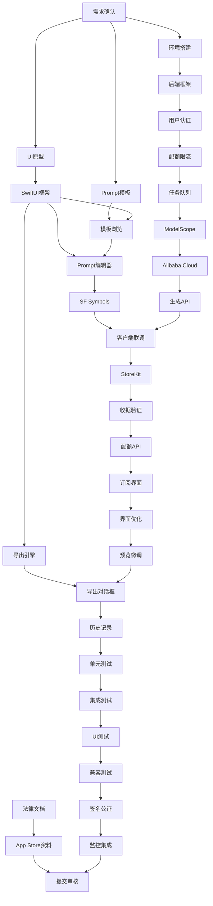

# Icons 项目开发任务清单与实施计划

基于《开发方案.md》制定的详细任务清单，按优先级和依赖关系分阶段推进开发工作。

## 1. 项目概览

**目标产品**：Icons - macOS 原生 AI 图标生成应用\
**核心功能**：自然语言/模板 → AI 生成 → .appiconset/.iconset 导出\
**商业模式**：免费版（每日2次，512×512，水印）+ Pro版（¥39/月，1024×1024，无水印）\
**预估周期**：MVP 8-11周，V1.0 完整版 12-16周

## 2. 开发阶段划分

### 阶段 0：项目准备与设计（第1-2周）

### 阶段 1：核心客户端开发（第3-5周）

### 阶段 2：后端中间层开发（第4-6周）

### 阶段 3：AI模型集成与测试（第6-7周）

### 阶段 4：订阅系统与支付（第7-8周）

### 阶段 5：UI/UX优化与测试（第8-10周）

### 阶段 6：上架准备与发布（第10-11周）

## 3. 详细任务清单

### 阶段 0：项目准备与设计（优先级：P0）

#### 3.1 需求确认与文档整理

* **任务编号**：T001

* **负责人**：产品经理 + 技术负责人

* **工期**：3天

* **交付物**：

  * 最终需求规格书（PRD）

  * 技术架构设计文档

  * UI/UX 设计规范

  * 项目里程碑计划

* **依赖**：无

* **验收标准**：所有团队成员确认需求，技术方案评审通过

#### 3.2 UI/UX 原型设计

* **任务编号**：T002

* **负责人**：UI/UX 设计师

* **工期**：5天

* **交付物**：

  * 完整 UI 原型（Figma/Sketch）

  * 设计系统规范（颜色、字体、组件）

  * 交互流程图

  * 响应式设计方案

* **依赖**：T001

* **验收标准**：原型通过用户体验评审，开发团队确认可实现性

#### 3.3 Prompt 模板库设计

* **任务编号**：T003

* **负责人**：AI 工程师 + 产品经理

* **工期**：4天

* **交付物**：

  * 10-20个风格化 Prompt 模板

  * 模板参数化规范（{style}, {app\_name}, {sf\_symbol}等）

  * 负面提示词库（negative prompts）

  * 模板测试结果报告

* **依赖**：T001

* **验收标准**：模板生成效果满足设计要求，参数化机制验证通过

#### 3.4 技术栈选型与环境搭建

* **任务编号**：T004

* **负责人**：技术负责人 + 后端工程师

* **工期**：2天

* **交付物**：

  * 开发环境配置文档

  * CI/CD 流水线配置

  * 代码仓库结构

  * 第三方服务账号申请（ModelScope, Alibaba Cloud）

* **依赖**：T001

* **验收标准**：开发环境可正常运行，CI/CD 流水线测试通过

### 阶段 1：核心客户端开发（优先级：P0）

#### 3.5 SwiftUI 基础框架搭建

* **任务编号**：T005

* **负责人**：iOS/macOS 开发工程师

* **工期**：3天

* **交付物**：

  * 项目基础架构代码

  * 导航结构实现

  * 状态管理框架（ObservableObject/StateObject）

  * 基础 UI 组件库

* **依赖**：T002, T004

* **验收标准**：应用可正常启动，基础导航功能正常

#### 3.6 模板浏览与选择功能

* **任务编号**：T006

* **负责人**：iOS/macOS 开发工程师

* **工期**：4天

* **交付物**：

  * 模板展示界面

  * 模板预览功能

  * 模板选择与应用逻辑

  * 模板数据模型

* **依赖**：T003, T005

* **验收标准**：用户可浏览并选择模板，预览效果正确显示

#### 3.7 Prompt 编辑器实现

* **任务编号**：T0079/ii

* **负责人**：iOS/macOS 开发工程师

* **工期**：5天

* **交付物**：

  * 多语言 Prompt 输入界面

  * 参数化模板填充功能

  * Prompt 历史记录

  * 示例 Prompt 展示

* **依赖**：T005, T006

* **验收标准**：用户可编辑 Prompt，模板参数正确替换，历史记录功能正常

#### 3.8 SF Symbols 搜索与集成

* **任务编号**：T008

* **负责人**：iOS/macOS 开发工程师

* **工期**：4天

* **交付物**：

  * SF Symbols 搜索界面

  * 符号预览与选择功能

  * 符号名称注入 Prompt 功能

  * 本地矢量 overlay 合成（可选）

* **依赖**：T007

* **验收标准**：用户可搜索并选择 SF Symbols，符号正确注入到 Prompt 中

#### 3.9 图标导出引擎开发

* **任务编号**：T009

* **负责人**：iOS/macOS 开发工程师

* **工期**：6天

* **交付物**：

  * icon-sizes.json 配置文件

  * vImage/CGImage 高质量缩放引擎

  * .appiconset/.iconset 生成器

  * Contents.json 自动生成

  * 多平台尺寸支持（iOS/macOS）

* **依赖**：T005

* **验收标准**：生成的图标包可在 Xcode 中正确导入，所有尺寸图片质量合格

### 阶段 2：后端中间层开发（优先级：P0）

#### 3.10 后端 API 框架搭建

* **任务编号**：T010

* **负责人**：后端工程师

* **工期**：3天

* **交付物**：

  * Node.js/Go/Python 后端框架

  * RESTful API 基础结构

  * 数据库设计与连接

  * 基础中间件（日志、错误处理、CORS）

* **依赖**：T004

* **验收标准**：后端服务可正常启动，基础 API 接口可访问

#### 3.11 用户认证与会话管理

* **任务编号**：T011

* **负责人**：后端工程师

* **工期**：4天

* **交付物**：

  * 用户注册/登录 API

  * JWT Token 生成与验证

  * 会话管理机制

  * 用户等级判定逻辑（Free/Pro）

* **依赖**：T010

* **验收标准**：用户可正常注册登录，Token 验证机制正常工作

#### 3.12 配额与限流系统

* **任务编号**：T012

* **负责人**：后端工程师

* **工期**：5天

* **交付物**：

  * 用户配额统计 API

  * 限流中间件（IP/用户/设备）

  * 配额重置机制（每日/每月）

  * 防滥用检测

* **依赖**：T011

* **验收标准**：配额统计准确，限流机制有效，防滥用检测正常

#### 3.13 任务队列与优先级管理

* **任务编号**：T013

* **负责人**：后端工程师

* **工期**：4天

* **交付物**：

  * 异步任务队列（Redis/RabbitMQ）

  * 优先级队列实现（Pro 用户优先）

  * 任务状态跟踪 API

  * 失败重试机制

* **依赖**：T012

* **验收标准**：任务队列正常工作，优先级机制有效，重试逻辑正确

### 阶段 3：AI模型集成与测试（优先级：P0）

#### 3.14 ModelScope API 集成

* **任务编号**：T014

* **负责人**：AI 工程师 + 后端工程师

* **工期**：4天

* **交付物**：

  * ModelScope API 调用封装

  * 免费用户路径实现

  * 图片水印添加功能

  * 错误处理与降级机制

* **依赖**：T013

* **验收标准**：ModelScope API 调用成功，水印添加正确，错误处理完善

#### 3.15 Alibaba Cloud Qwen-Image 集成

* **任务编号**：T015

* **负责人**：AI 工程师 + 后端工程师

* **工期**：5天

* **交付物**：

  * Alibaba Cloud API 调用封装

  * Pro 用户路径实现

  * 高质量图片处理

  * 对象存储集成（图片缓存）

* **依赖**：T014

* **验收标准**：Alibaba Cloud API 调用成功，图片质量满足要求，存储机制正常

#### 3.16 图片生成 API 实现

* **任务编号**：T016

* **负责人**：后端工程师

* **工期**：3天

* **交付物**：

  * POST /v1/generate API

  * GET /v1/task/{task\_id} API

  * 异步任务处理逻辑

  * 图片 URL/base64 返回

* **依赖**：T015

* **验收标准**：API 接口功能完整，异步处理正常，返回数据格式正确

#### 3.17 客户端与后端联调

* **任务编号**：T017

* **负责人**：全栈工程师

* **工期**：4天

* **交付物**：

  * 客户端网络请求封装

  * 生成进度显示

  * 错误处理与用户提示

  * 候选图片展示

* **依赖**：T008, T016

* **验收标准**：客户端可正常调用后端 API，生成流程完整，错误处理友好

### 阶段 4：订阅系统与支付（优先级：P1）

#### 3.18 StoreKit 2 集成

* **任务编号**：T018

* **负责人**：iOS/macOS 开发工程师

* **工期**：5天

* **交付物**：

  * StoreKit 2 配置

  * 订阅产品定义（月付/年付）

  * 购买流程实现

  * 本地收据验证

* **依赖**：T017

* **验收标准**：用户可正常购买订阅，收据验证通过，订阅状态正确

#### 3.19 服务端收据验证

* **任务编号**：T019

* **负责人**：后端工程师

* **工期**：4天

* **交付物**：

  * POST /v1/receipt/verify API

  * App Store Server API 集成

  * 订阅状态同步

  * 订阅过期处理

* **依赖**：T018

* **验收标准**：服务端可验证收据，订阅状态同步准确，过期处理正确

#### 3.20 配额管理 API

* **任务编号**：T020

* **负责人**：后端工程师

* **工期**：3天

* **交付物**：

  * GET /v1/quota API

  * 订阅状态查询

  * 剩余次数计算

  * Pro 权益验证

* **依赖**：T019

* **验收标准**：配额查询准确，订阅权益验证正确，API 响应及时

#### 3.21 订阅管理界面

* **任务编号**：T021

* **负责人**：iOS/macOS 开发工程师

* **工期**：4天

* **交付物**：

  * 账户页面设计实现

  * 订阅状态显示

  * 剩余次数展示

  * 升级 Pro 引导

* **依赖**：T020

* **验收标准**：界面美观易用，信息显示准确，升级流程顺畅

### 阶段 5：UI/UX优化与测试（优先级：P1）

#### 3.22 主界面布局优化

* **任务编号**：T022

* **负责人**：iOS/macOS 开发工程师 + UI/UX 设计师

* **工期**：5天

* **交付物**：

  * 三栏布局实现（模板栏-画布-属性面板）

  * 响应式设计适配

  * 动画效果添加

  * 用户体验优化

* **依赖**：T021

* **验收标准**：界面布局合理，交互流畅，视觉效果佳

#### 3.23 图标预览与微调功能

* **任务编号**：T023

* **负责人**：iOS/macOS 开发工程师

* **工期**：4天

* **交付物**：

  * 1:1/2x 预览模式

  * 颜色替换功能

  * 符号替换功能

  * 再生成功能

* **依赖**：T022

* **验收标准**：预览效果准确，微调功能正常，操作响应及时

#### 3.24 导出对话框实现

* **任务编号**：T024

* **负责人**：iOS/macOS 开发工程师

* **工期**：3天

* **交付物**：

  * 平台选择（iOS/macOS/通用）

  * 尺寸集合配置

  * 文件命名规则

  * ZIP 打包选项

* **依赖**：T009, T023

* **验收标准**：导出选项完整，文件生成正确，打包功能正常

#### 3.25 历史记录与管理

* **任务编号**：T025

* **负责人**：iOS/macOS 开发工程师

* **工期**：4天

* **交付物**：

  * 本地历史记录存储

  * 历史浏览界面

  * 记录删除功能

  * 导出记录管理

* **依赖**：T024

* **验收标准**：历史记录完整，管理功能正常，存储机制可靠

### 阶段 6：测试与质量保证（优先级：P1）

#### 3.26 单元测试开发

* **任务编号**：T026

* **负责人**：全栈工程师

* **工期**：5天

* **交付物**：

  * Prompt 格式化测试

  * Contents.json 生成测试

  * PNG 尺寸正确性测试

  * 配额计数器测试

  * 测试覆盖率报告

* **依赖**：T025

* **验收标准**：测试覆盖率 > 80%，所有核心功能测试通过

#### 3.27 集成测试

* **任务编号**：T027

* **负责人**：测试工程师 + 后端工程师

* **工期**：4天

* **交付物**：

  * API 接口测试

  * 模型调用测试

  * 断网/超时/重试测试

  * 性能压力测试

* **依赖**：T026

* **验收标准**：所有接口测试通过，异常处理正确，性能指标达标

#### 3.28 UI 自动化测试

* **任务编号**：T028

* **负责人**：测试工程师 + iOS/macOS 开发工程师

* **工期**：4天

* **交付物**：

  * XCUITest 测试用例

  * 关键流程自动化测试

  * 回归测试套件

  * 测试报告

* **依赖**：T027

* **验收标准**：关键流程测试通过，自动化测试稳定运行

#### 3.29 手动兼容性测试

* **任务编号**：T029

* **负责人**：测试工程师

* **工期**：3天

* **交付物**：

  * Xcode 项目导入测试

  * 多版本 macOS 兼容测试

  * 不同分辨率屏幕测试

  * 兼容性测试报告

* **依赖**：T028

* **验收标准**：生成的图标包在 Xcode 中正确显示，多环境兼容性良好

### 阶段 7：上架准备与发布（优先级：P1）

#### 3.30 应用签名与公证

* **任务编号**：T030

* **负责人**：DevOps 工程师

* **工期**：3天

* **交付物**：

  * 开发者证书配置

  * 应用签名流程

  * 公证（notarize）流程

  * 自动化构建脚本

* **依赖**：T029

* **验收标准**：应用可正常签名和公证，构建流程自动化

#### 3.31 法律文档准备

* **任务编号**：T031

* **负责人**：产品经理 + 法务

* **工期**：4天

* **交付物**：

  * 隐私政策

  * 用户协议（EULA）

  * 商用授权说明

  * 订阅条款

  * 模型来源声明

* **依赖**：无（可并行）

* **验收标准**：所有法律文档完整，符合 App Store 审核要求

#### 3.32 App Store 资料准备

* **任务编号**：T032

* **负责人**：产品经理 + 设计师

* **工期**：3天

* **交付物**：

  * 应用描述文案

  * 截图和预览视频

  * 关键词优化

  * 应用图标设计

* **依赖**：T031

* **验收标准**：App Store 资料完整，符合苹果审核指南

#### 3.33 监控与分析集成

* **任务编号**：T033

* **负责人**：后端工程师

* **工期**：3天

* **交付物**：

  * Sentry/Crashlytics 集成

  * 业务指标监控

  * 用户行为分析

  * 告警机制配置

* **依赖**：T030

* **验收标准**：监控系统正常工作，关键指标可正常采集

#### 3.34 应用提交与审核

* **任务编号**：T034

* **负责人**：产品经理

* **工期**：5天（包含审核等待）

* **交付物**：

  * App Store Connect 提交

  * 审核问题响应

  * 发布计划执行

  * 上线后监控

* **依赖**：T032, T033

* **验收标准**：应用通过审核并成功上架

## 4. 依赖关系图

## 5. 关键里程碑

### 里程碑 1：基础框架完成（第3周末）

* **交付物**：客户端基础框架、后端 API 框架、基础 UI 界面

* **验收标准**：应用可启动，基础导航正常，后端 API 可访问

### 里程碑 2：核心功能完成（第5周末）

* **交付物**：模板浏览、Prompt 编辑、SF Symbols 集成、图标导出

* **验收标准**：用户可完成完整的图标生成和导出流程（本地测试）

### 里程碑 3：AI 集成完成（第7周末）

* **交付物**：ModelScope 和 Alibaba Cloud 集成、客户端后端联调

* **验收标准**：用户可通过 AI 生成图标，免费和 Pro 路径都正常工作

### 里程碑 4：订阅系统完成（第8周末）

* **交付物**：StoreKit 集成、收据验证、配额管理、订阅界面

* **验收标准**：用户可购买订阅，配额限制正常，Pro 权益生效

### 里程碑 5：测试完成（第10周末）

* **交付物**：完整测试套件、性能优化、兼容性验证

* **验收标准**：所有测试通过，应用稳定性达到发布标准

### 里程碑 6：发布上线（第11周末）

* **交付物**：App Store 上架、监控系统、用户反馈收集

* **验收标准**：应用成功上架，监控正常，无严重 bug

## 6. 质量控制检查点

### 6.1 代码质量检查点

* **频率**：每周

* **检查内容**：

  * 代码规范遵循（Swift API Design Guidelines）

  * 单元测试覆盖率（目标 > 80%）

  * 代码审查完成率（100%）

  * 技术债务评估

### 6.2 功能质量检查点

* **频率**：每个里程碑

* **检查内容**：

  * 需求实现完整性

  * 用户体验测试

  * 性能指标达标

  * 安全性检查

### 6.3 发布质量检查点

* **频率**：发布前

* **检查内容**：

  * 完整回归测试

  * 兼容性测试

  * 性能压力测试

  * 安全漏洞扫描

  * 法律合规检查

## 7. 风险管控

### 7.1 技术风险

* **AI 模型 API 不稳定**：准备降级方案，实现多模型切换

* **图标导出兼容性问题**：提前在多个 Xcode 版本中测试

* **性能问题**：定期进行性能测试，及时优化

### 7.2 进度风险

* **任务延期**：设置缓冲时间，关键路径任务优先保障

* **人员变动**：重要模块至少 2 人熟悉，做好知识传递

* **需求变更**：严格控制需求变更，重大变更需重新评估进度

### 7.3 商业风险

* **App Store 审核被拒**：提前了解审核指南，准备申诉材料

* **第三方服务变更**：关注 ModelScope 和 Alibaba Cloud 政策变化

* **竞品影响**：持续关注市场动态，保持产品差异化优势

## 8. 成功指标

### 8.1 开发指标

* 按时交付率 > 90%

* 代码质量评分 > 8.0/10

* 测试覆盖率 > 80%

* 严重 bug 数量 < 5 个

### 8.2 产品指标

* App Store 审核一次通过

* 用户评分 > 4.0/5.0

* 免费用户转化率 > 5%

* 月活跃用户 > 1000（上线后 3 个月）

### 8.3 技术指标

* API 响应时间 < 2s（95%）

* 应用启动时间 < 3s

* 崩溃率 < 0.1%

* 图标生成成功率 > 95%

***

**文档版本**：v1.0\
**最后更新**：2024年12月\
**负责人**：项目经理\
**审核人**：技术负责人、产品负责人
